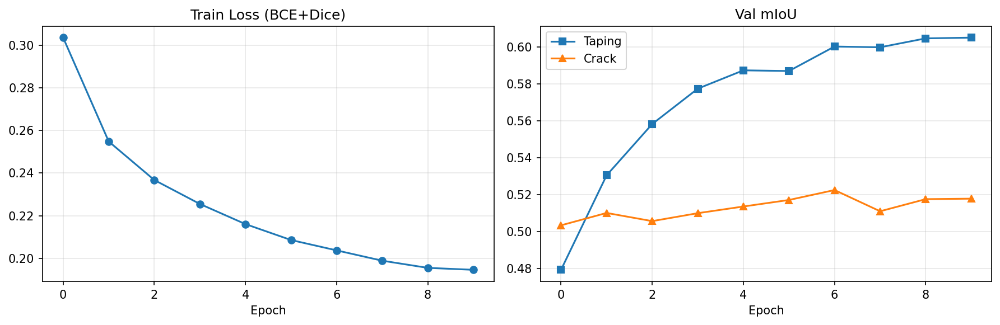
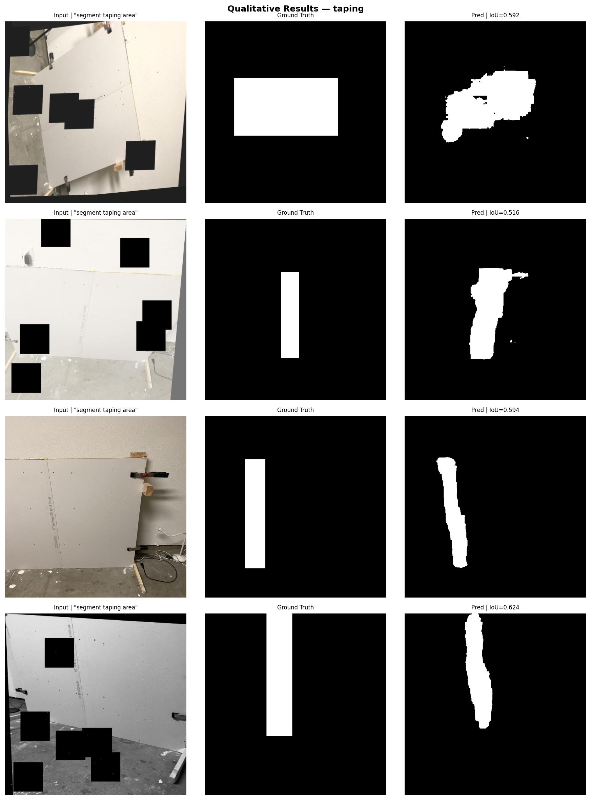
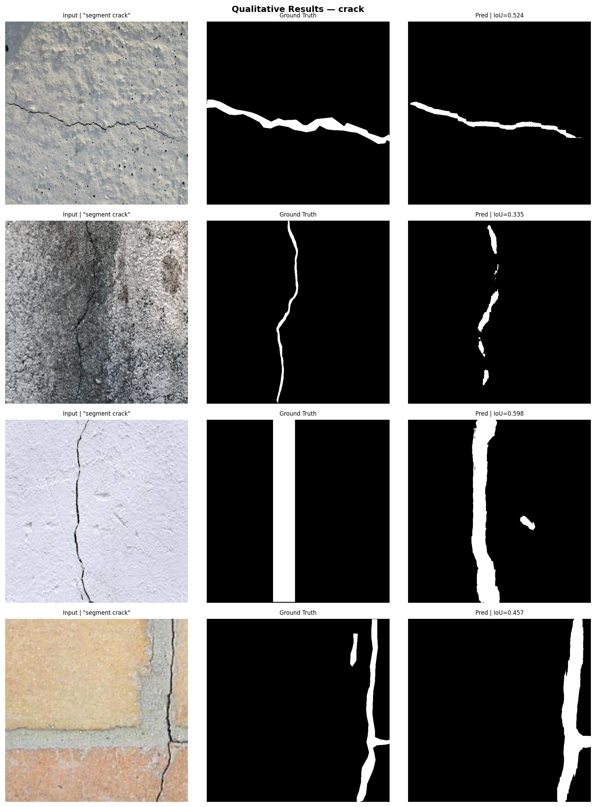

# Prompted Segmentation for Drywall QA
**AI Research Intern — Take-Home Assignment | Origin (formerly 10xConstruction)**

**Pranav Prashant Shewale** | Seed: 42 | Device: CUDA (Colab T4)

[](https://colab.research.google.com/drive/1kOUcWBFAuWFWUTDwcDMnD2Mk0emvosIX?usp=sharing)

---

## Results at a Glance

| Metric | Taping Area | Cracks |
|--------|-------------|--------|
| **mIoU** | **0.6051** | **0.5178** |
| **Dice** | **0.7401** | **0.6646** |
| Precision | 0.7385 | 0.6851 |
| Recall | 0.7770 | 0.7261 |
| Avg inference | 36.2 ms / image (T4 GPU) | — |
| Train time | 63.7 min (10 epochs, Colab T4) | — |

---

## Overview

Fine-tuned **CLIPSeg** (`CIDAS/clipseg-rd64-refined`) for text-conditioned binary segmentation on two construction-domain datasets:

| Prompt | Dataset | Task |
|--------|---------|------|
| `"segment taping area"` | Drywall-Join-Detect | Detect drywall tape/joint seams |
| `"segment crack"` | Cracks | Detect surface cracks on walls |

---

## Methodology

### Why CLIPSeg?
CLIPSeg is natively text-conditioned — a single forward pass with an image + text prompt produces a dense segmentation map. This is a direct architectural fit for the prompted-segmentation objective, with no need for a separate detection stage (unlike GroundedSAM). The `rd64-refined` variant runs comfortably on a Colab T4 with ~2 GB VRAM.

### Training Strategy
- **Freeze CLIP backbone** — only the FiLM decoder (~0.5M params) is fine-tuned, preserving visual-language alignment and avoiding overfitting on small datasets
- **Loss:** 50% BCE + 50% Dice — Dice combats class imbalance on thin seams and hairline cracks
- **Prompt augmentation:** 4 phrasings per class randomly sampled during training; canonical prompt at inference
- **Optimiser:** AdamW (lr=1e-4, weight_decay=1e-4) with CosineAnnealingLR over 10 epochs

### Hyperparameters
| Param | Value |
|-------|-------|
| Epochs | 10 |
| Batch size | 4 |
| Learning rate | 1e-4 |
| LR schedule | CosineAnnealingLR (T_max=10) |
| Image size | 352 × 352 |
| Loss weights | BCE: 0.5 / Dice: 0.5 |
| **Seed** | **42** |

---

## Data Preparation

Both datasets were sourced from Roboflow Universe and forked into a personal workspace (`general-okp9d`). A dataset version was generated for each project to enable programmatic download. The bounding box annotations were already present in the original public datasets — no manual labelling was performed.

| | Dataset 1 — Taping | Dataset 2 — Cracks |
|--|--|--|
| **Source** | Roboflow: drywall-join-detect | Roboflow: cracks-3ii36 |
| **Annotation** | COCO bbox (pre-existing) | COCO bbox (pre-existing) |
| **Total images** | 1,022 | 5,369 |
| **Train / Val / Test** | 820 / 202 / — | 5,164 / 201 / 4 |
| **Inference prompt** | `"segment taping area"` | `"segment crack"` |

Bounding boxes were converted to binary mask PNGs via `cv2.rectangle` (with `cv2.fillPoly` fallback when polygon segmentation fields exist). Masks binarised to {0, 255} and resized to 352×352.

---

## Qualitative Results

### Training Curves


### Taping Area — Input | Ground Truth | Prediction


### Cracks — Input | Ground Truth | Prediction


---

## Output Masks

Prediction PNGs are saved in `predictions/` with format:
```
{image_id}__{prompt_with_underscores}.png
```
Examples: `img001__segment_crack.png`, `img042__segment_taping_area.png`

- Single-channel PNG
- Same spatial resolution as source image
- Pixel values: `{0, 255}` (binary)

---

## Failure Cases

| # | Failure | IoU | Cause | Fix |
|---|---------|-----|-------|-----|
| 1 | Thin hairline crack missed | 0.335 | Sub-pixel fracture within single 64px patch | Multi-scale inference; CLAHE augmentation |
| 2 | Fragmented mask on textured background | 0.335 | Coarse aggregate triggers false activations | Connected-component filtering; morphological closing |
| 3 | Bbox GT mismatch on taping | 0.592 | GT rectangle larger than actual tape seam | Re-annotate with polygon masks |
| 4 | Low-contrast crack on white wall | 0.598 | Small intensity gradient at 352px | Sobel edge channel; pseudo-labeling |

---

## Repository Structure

```
VLM-PROMPTED-SEGMENTATION/
├── notebooks/
│   └── clipseg_drywall_qa.ipynb     # Full pipeline — data download to report
├── predictions/                      # Output masks (PNG, {0,255})
│   └── {image_id}__{prompt}.png
├── results/
│   ├── metrics.json                  # mIoU, Dice, Precision, Recall per class
│   ├── training_curves.png           # Loss + mIoU across epochs
│   ├── viz_crack.png                 # Qualitative: input | GT | pred (cracks)
│   └── viz_taping.png                # Qualitative: input | GT | pred (taping)
├── .gitignore
├── README.md
└── requirements.txt
```

---

## How to Run

1. Open `notebooks/clipseg_drywall_qa.ipynb` in Google Colab
2. Set runtime to **T4 GPU**: `Runtime > Change runtime type`
3. In Cell 1, paste your Roboflow API key
4. Run all cells (`Runtime > Run all`)
5. Move outputs to `results/` and `predictions/` as per the repo structure above

**Expected runtime:** ~65 minutes (10 epochs, Colab T4)

---

## Requirements

```
transformers==4.40.0
roboflow
torch
torchvision
opencv-python-headless
matplotlib
scikit-learn
Pillow
tqdm
```

---

**Seed:** 42 &nbsp;|&nbsp; cuDNN deterministic=True, benchmark=False
